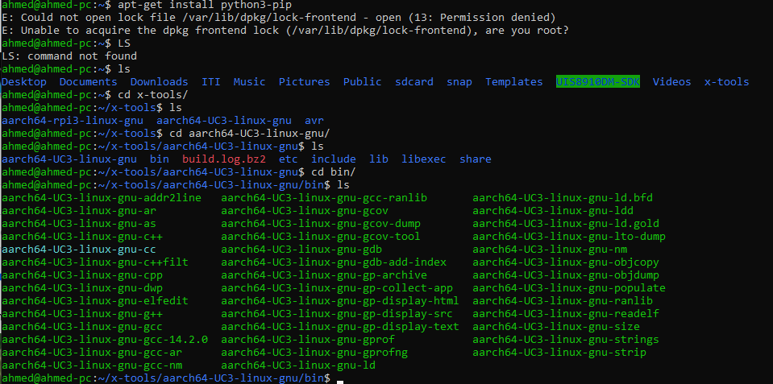
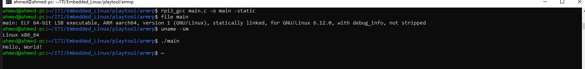
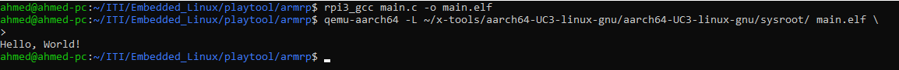

# Creating a Cross Toolchain Using Crosstool-NG

## Installation Process
### Getting Started clone Crosstool-NG and build

 ``` bash
    ./Crosstool-NG_install.sh
 ```

### **Configuration Process for Crosstool-NG**

#### **1. List Available Sample Configurations**
- Use the following command to list predefined toolchain configurations for various architectures:
  
  ```bash
  ./ct-ng list-samples | grep rpi3
  ```

  This filters for available samples related to the Raspberry Pi 3.

---

#### **2. Change Target to Raspberry Pi 3**
- Set up the target architecture for Raspberry Pi 3 by using its predefined sample configuration:

  ```bash
  ./ct-ng aarch64-rpi3-linux-gnu
  ```

  This command initializes the configuration for a 64-bit ARM toolchain targeting the Raspberry Pi 3.

---

#### **3. Modify Configuration (Optional)**
- To customize the toolchain further, open the configuration menu:

  ```bash
  ./ct-ng menuconfig
  ```

  Here you can:
  - Adjust the build options.
  - Set compiler versions.
  - Configure libraries (e.g., glibc or uClibc).
  - Enable or disable debugging symbols.

---

#### **4. Build the Toolchain**
- Start building the toolchain with:

  ```bash
  ./ct-ng build
  ```

- The build process will:
  1. Download required sources.
  2. Compile the cross-toolchain for the target architecture.
  3. Install the toolchain in the configured installation directory (typically under `~/.build` or as specified in the configuration).

---

### **Tips**
- **Prerequisites**: Ensure all dependencies for Crosstool-NG are installed on your host system. Use:
  ```bash
  sudo apt-get install autoconf bison flex texinfo gawk libtool-bin gcc g++ gperf
  ```
- **Path Management**: After building the toolchain, add its `bin` directory to your `PATH` to make it accessible.
  ```bash
  export PATH=$HOME/x-tools/aarch64-rpi3-linux-gnu/bin:$PATH
  ```
- **Log Files**: If the build fails, check the log files in the `.build` directory for detailed error messages.


### **Steps**

#### **1. Set up the Compiler Alias**
- Use the following command to set up an alias for your Raspberry Pi's cross-compiler:
  ```bash
  alias rpi3_gcc='/home/ahmed/x-tools/aarch64-UC3-linux-gnu/bin/aarch64-UC3-linux-gnu-cc'
  ```

- To make the alias permanent, add it to your `.bashrc`:
  ```bash
  echo "alias rpi3_gcc='/home/ahmed/x-tools/aarch64-UC3-linux-gnu/bin/aarch64-UC3-linux-gnu-cc'" >> ~/.bashrc
  source ~/.bashrc
  ```

---

#### **2. Write the `Hello, World!` Program**
- Save the following code in a file called `main.c`:
  ```c
  #include <stdio.h>

  int main() {
      printf("Hello, World!\n");
      return 0;
  }
  ```

---

#### **3. Compile Using the Cross-Compiler**
- Compile the `main.c` file into a static binary executable:
  ```bash
  rpi3_gcc main.c -o main.o --static
  ```

  **Explanation**:
  - `main.c`: Source file to compile.
  - `-o main.o`: Specifies the output file name.
  - `--static`: Statically links all libraries, ensuring the binary can run independently of the host system's libraries.

- Compile the `main.c` file into dynamic binary executable:
  ```bash
  rpi3_gcc main.c -o main.o 
  ```

  **Explanation**:
  - `main.c`: Source file to compile.
  - `-o main.o`: Specifies the output file name.
---

#### **4. Transfer the Executable to the Raspberry Pi**
If the compiled file is meant to run on your Raspberry Pi, transfer the `main.o` file using tools like `scp`.

- Example:
  ```bash
  scp main.o pi@raspberrypi:/home/pi/
  ```

Replace `pi` and `raspberrypi` with the username and IP address of your Raspberry Pi.

---

#### **5. Run the Executable**
1. If running locally on the same machine:
   ```bash
   ./main.o
   ```

2. If running on the Raspberry Pi:
   - SSH into your Raspberry Pi:
     ```bash
     ssh pi@raspberrypi
     ```
   - Run the executable:
     ```bash
     ./main.o
     ```

   Output:
   ```
   Hello, World!
   ```

---

### **Notes**
- **Cross-Compiler Validation**: Ensure that your cross-compiler is for the correct architecture (`aarch64`) and matches your Raspberry Pi's configuration.
- **Static Linking**: Using `--static` ensures compatibility but results in a larger binary. If size is a concern, omit `--static`.
- **Permissions**: If you get a "Permission denied" error, make the file executable:
  ```bash
  chmod +x main.o
  ```

Would you like help with automating this process or debugging issues during cross-compilation?




