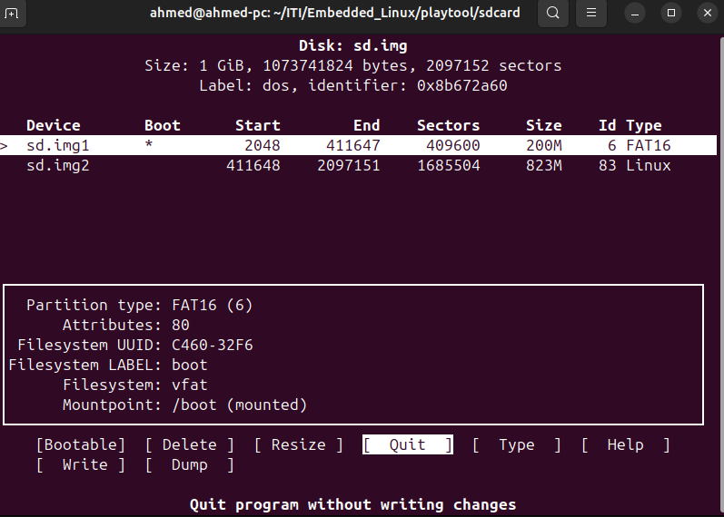
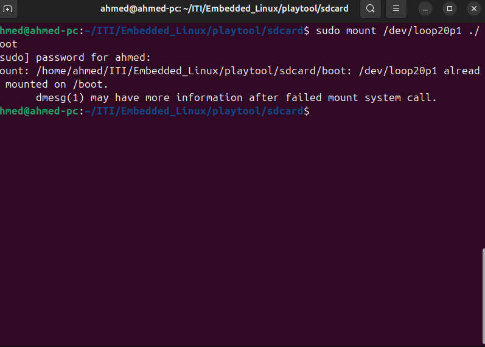

# Creating a Virtual SD Card

## Installation Process

To create a file of exactly 1 GB in size using the dd command, you can run the following command in a Unix-like system

 ``` bash
    dd if=/dev/zero of=sd.img bs=1M count=1024
 ```

### Explanation

- `if=/dev/zero`: Uses `/dev/zero` as the input source, which provides a continuous stream of zero bytes.
- `of=sd.img`: Specifies the output file name, in this case, `sd.img`.
- `bs=1M`: Sets the block size to 1 megabyte (MB).
- `count=1024`: Specifies that 1024 blocks should be written, creating a 1 GB file (since 1024 blocks × 1MB/block = 1GB).
This will create a file named `sd.img` that is exactly 1 GB in size, filled with zeros.

---

## Partitioning a Disk Image Using cfdisk

``` bash
cfdisk sd.img
# choose DOS
# create a partition with size 200M + make it bootable + choose the filesystem as FAT16 (option 6)
# create a partition with the rest of the available space + choose the filesystem as EXT4 (option 83)
# choose write, then exit
```

## Attach and Scan Partitions in a Disk Image

command you've provided is used to set up a loop device and associate it with a disk image file (`sd.img`). Here’s a breakdown of the command:

### Command

```bash
sudo losetup --partscan --show -f sd.img
```

### Explanation

- `sudo`: Runs the command with superuser (root) privileges.
- `losetup`: A command used to set up and manage loop devices (used to mount disk images as if they were physical disks).
- `--partscan`: Automatically scans the partitions on the loop device. This makes sure that the partitions in the disk image are recognized and set up accordingly.
- `--show`: Displays the name of the loop device that was assigned.
- `-f`: Automatically finds the first available loop device (e.g., `/dev/loop0`, `/dev/loop1`, etc.).
- `sd.img`: The disk image file that you want to associate with a loop device.

### What this does

1. It finds an available loop device (e.g., `/dev/loop0`).
2. It associates the disk image (`sd.img`) with the loop device.
3. It performs a partition scan (`--partscan`) to make the partitions inside the disk image available.
4. The `--show` option will display the name of the loop device (e.g., `/dev/loop0`).

### Example Output

```bash
/dev/loop0
```

This means the `sd.img` file has been successfully attached to `/dev/loop0`. You can now work with the partitions inside `sd.img` (e.g., mount them or manipulate the contents).

## Reating FAT16 and EXT4 Filesystems on Partitions

Here’s a detailed explanation of the two commands you've provided:

### 1. **Creating a FAT16 Filesystem (for boot partition)**

```bash
mkfs.vfat -F 16 -n boot /dev/loop22p1
```

- **`mkfs.vfat`**: This command is used to create a VFAT filesystem, commonly used for FAT16 and FAT32.
- **`-F 16`**: Specifies the filesystem type as FAT16 (which is compatible with older systems and typically used for boot partitions).
- **`-n boot`**: Sets the label of the partition to "boot", making it easily recognizable.
- **`/dev/loop22p1`**: Refers to the first partition (`p1`) of the loop device `/dev/loop22` that you attached to the disk image.

This command will format the first partition of the disk image (`/dev/loop22p1`) with the FAT16 filesystem and label it "boot". This partition will likely be used as the bootable partition.

---

### 2. **Creating an EXT4 Filesystem (for root filesystem)**

```bash
mkfs.ext4 -L rootfs /dev/loop22p2
```

- **`mkfs.ext4`**: This command is used to create an EXT4 filesystem, which is widely used for Linux root filesystems.
- **`-L rootfs`**: This sets the label of the partition to "rootfs", which is a common label for root filesystems.
- **`/dev/loop22p2`**: Refers to the second partition (`p2`) of the loop device `/dev/loop22`.

This command will format the second partition of the disk image (`/dev/loop22p2`) with the EXT4 filesystem and label it "rootfs". This partition will likely serve as the root filesystem.

---


## Mounting a Partition to a Directory for File Access and Management
The command you provided is used to mount the first partition of a disk image to a directory on your filesystem. Here's a breakdown:

### Command:
```bash
mount /dev/loop20p1 ./boot
```

### Explanation:
- **`mount`**: This command is used to mount a filesystem, making its contents accessible at a specific location (a mount point).
- **`/dev/loop20p1`**: This refers to the first partition (`p1`) of the loop device (`/dev/loop20`) that was created when you associated the disk image (`sd.img`) with the loop device.
- **`./boot`**: This is the mount point, a directory where the partition will be mounted. The `./boot` indicates that the partition will be mounted in the `boot` directory of the current working directory.

### What this does:
- It mounts the partition `/dev/loop22p1` (which you've formatted as FAT16) to the `boot` directory in the current working directory.
- This allows you to access and manage the contents of the partition (such as copying boot files, etc.).

### Before Running the Command:
Make sure that the `boot` directory exists in your current directory. You can create it if it doesn't exist with the following command:
```bash
mkdir boot
```

### Example Usage:
After mounting the partition, you can copy files to it, like bootloaders, kernel images, or other boot-related files.

### Unmounting the Partition:
After you’re done working with the mounted partition, you can unmount it using the following command:
```bash
sudo umount ./boot
```


